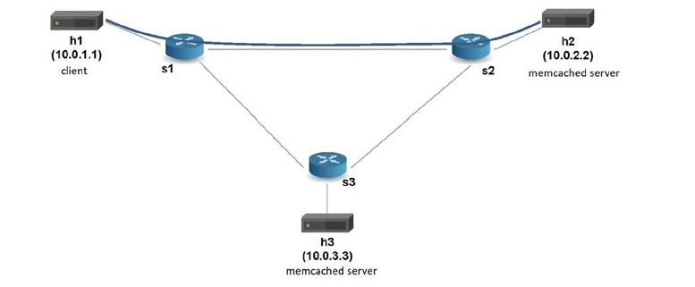

# "Advanced Topics in IP Networks" 
 M.Sc. course at the Reichman University <br/>
<br/>
# p4lang_memcached_load_balancer
<br/>
## Introduction
In this assignment, I had to develop a P4 application – a memcached load balancer. <br/>
I was supposed to use the Mininet virtual network to simulate a network that contains two memcached servers and a client host. <br/> 
The network is presented in the following figure:
<br/>

<br/>
## The Goal
Performing load balancing between the two memcached servers. <br/>
The client h1 (10.0.1.1) sends memcached UDP requests to its default gateway s1 (10.0.0.1). <br/> 
The switch flow table should contain rules that direct the memcached requests to one of the memcached servers h2, h3 (10.0.2.2, 10.0.3.3), each one contains a different set of keys and values. <br/>
In this assignment I had to write a P4 code to direct the incoming memcached requests packets to one of the servers based on the requested key in the UDP packet. <br/>
Specifically, I had to apply the following load balancing policy:  <br/>
Given a key (that we define to always be of length 5 bytes), check the last character of the key. <br/>
If it is an even digit, send the request to h2. If it is an odd digit, send it to h3. If it is not a digit, send it to h2. <br/>
So, for example, a request from h1 to 10.0.0.1, with the key “key01” will go to h3, while requests with the keys “key02” or “other” will go to h2. <br/>
We assume that all the requests have keys of length of exactly 5 bytes and we should not expect or handle other types of requests. <br/>
<br/>
## Running the project
1. In your shell, go to the directory `/home/p4/tutorials/exercises/memcached`, and then run:<br/>
   ```bash
   make
   ``` 
   That `make` script should start the mininet environment and open the mininet shell.<br/>
2. Run h1-h3 nodes with `xterm` command:<br/>
   ```bash
   xterm h1 h2 h3
   ```
   Now, you will notice 3 new terminal windows, named h1 to h3. <br/>
3. In the terminal window of h2, type: 
   ```bash
   ./start_h2_server.sh
   ```
   That will start the memcached server on h2 and add some entries. <br/>
4. In the terminal window of h3, do the same thing: <br/>
   ```bash
   ./start_h3_server.sh
   ```
   That will also start the memcached server on h3 and add some entries. <br/>
5. In the terminal window of h1, type: <br/>
   ```bash
   ./send_memcached_get.sh 10.0.0.1 key01
   ``` 
   And the result is expected to be the value of key01 in h3. <br/>
   Likewise, requests for other (existing) keys should yield the corresponding values from the corresponding server, based on the policy above.<br/>
